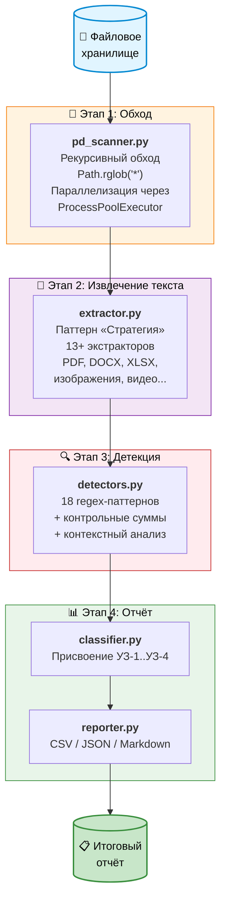
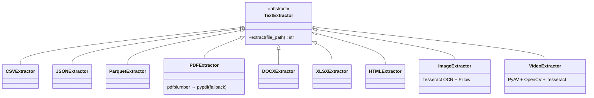
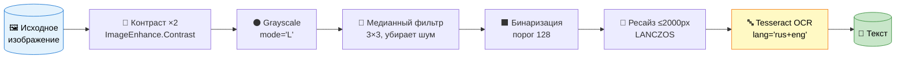
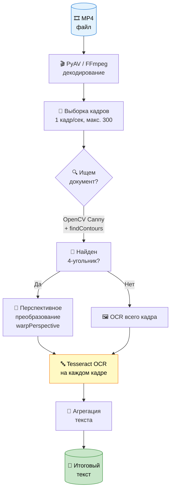
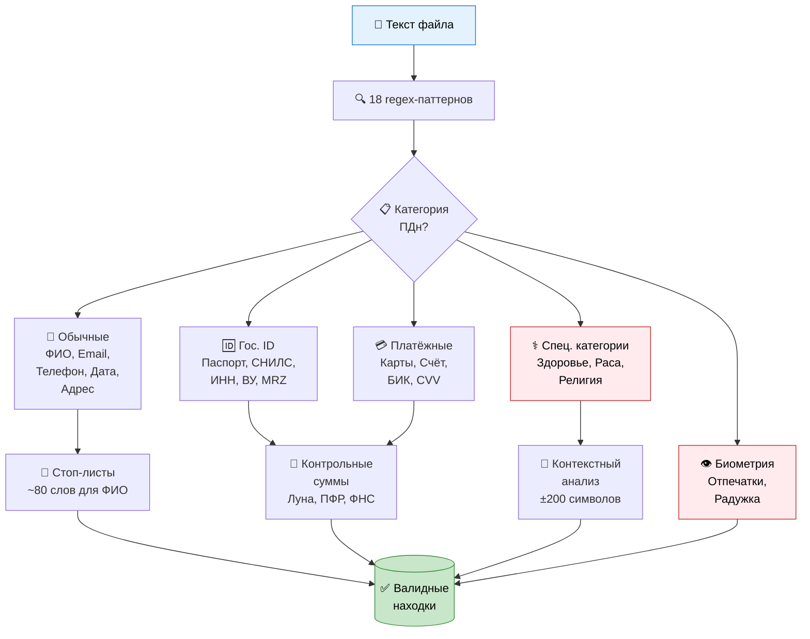
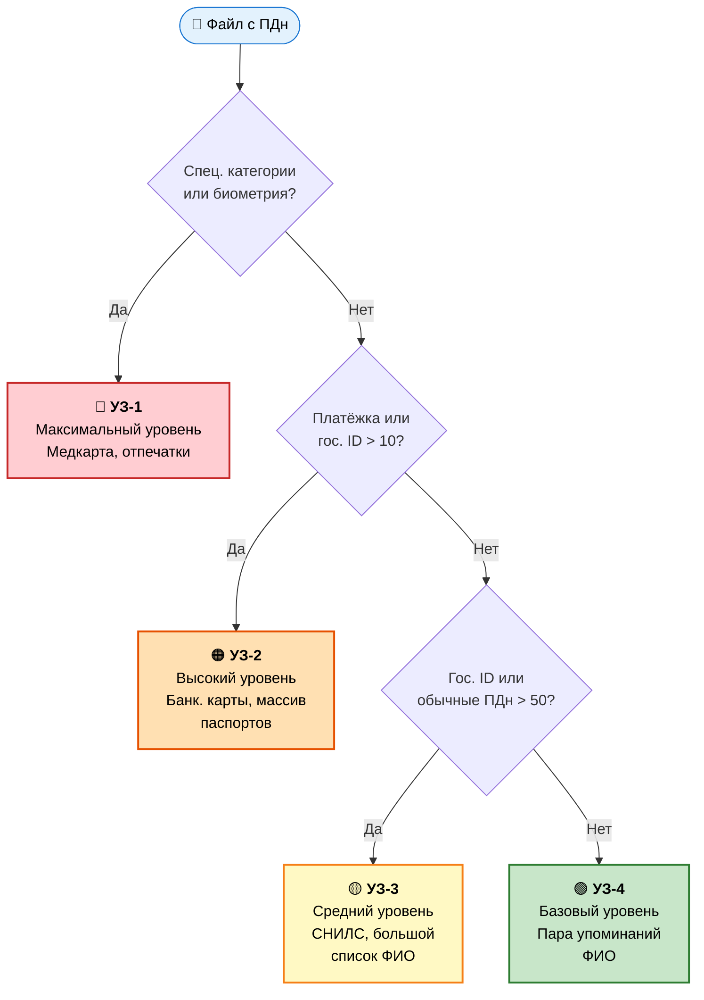

<div align="center">

# 🔍 Find Yourself in Big Data

### Автоматический сканер персональных данных в корпоративных хранилищах


*Находит ПДн в файловом хранилище, классифицирует по категориям и присваивает уровень защищённости согласно ПП РФ № 1119*

</div>

---

## 📑 Оглавление

- [💡 Общая идея](#-общая-идея)
- [🏗️ Архитектура](#️-архитектура)
- [⚙️ Этапы работы](#️-этапы-работы)
  - [Этап 1. Обход файлов и параллелизация](#этап-1-обход-файлов-и-параллелизация)
  - [Этап 2. Извлечение текста](#этап-2-извлечение-текста)
  - [Этап 3. Детекция персональных данных](#этап-3-детекция-персональных-данных)
  - [Этап 4. Классификация и отчёт](#этап-4-классификация-и-отчёт)
- [🚀 Запуск](#-запуск)
- [🐛 Проблемы, с которыми мы столкнулись](#-проблемы-с-которыми-мы-столкнулись)

---

## 💡 Общая идея

> Скрипт автоматически сканирует корпоративное файловое хранилище и находит файлы, содержащие персональные данные (ПДн), в соответствии с требованиями **Федерального закона № 152-ФЗ** «О персональных данных». Для каждого найденного файла определяется набор категорий ПДн, подсчитывается количество совпадений и присваивается уровень защищённости (**УЗ-1 … УЗ-4**) на основании **Постановления Правительства РФ № 1119**.

**Ключевая задача** — дать службе информационной безопасности полную картину того, где в хранилище лежат чувствительные данные, какого они типа и насколько критичен каждый файл.

### 🎯 Что умеет сканер

| Возможность | Описание |
|-------------|----------|
| 📁 **Много форматов** | 13+ типов файлов: от CSV до MP4 |
| 🔎 **18 категорий ПДн** | ФИО, паспорт, СНИЛС, банк. карты, биометрия, здоровье и др. |
| ⚡ **Параллелизм** | `ProcessPoolExecutor` — масштабируется по ядрам CPU |
| 👁️ **OCR** | Распознавание текста в изображениях и видео через Tesseract |
| ✅ **Валидация** | Контрольные суммы, стоп-листы, контекстный анализ |
| 📊 **3 формата отчёта** | CSV, JSON, Markdown |

---

## 🏗️ Архитектура

Работа скрипта состоит из четырёх последовательных этапов:



---

## ⚙️ Этапы работы

### Этап 1. Обход файлов и параллелизация

Точка входа — `pd_scanner.py`. Скрипт принимает путь к директории и рекурсивно обходит её через `Path.rglob('*')`, собирая полный список файлов. Каждый файл отправляется на обработку в отдельный процесс.

> 💡 **Почему процессы, а не потоки?**
> Основная нагрузка — CPU-bound операции (regex-матчинг, OCR). GIL в Python ограничивает потоки, а `ProcessPoolExecutor` даёт настоящий параллелизм.

**Параметры:**

- Количество воркеров задаётся флагом `-w`; по умолчанию — `os.cpu_count()`
- Прогресс отображается через `tqdm` (полоса прогресса, скорость, ETA, счётчик находок)
- Результаты агрегируются через `as_completed` — по мере готовности каждого `Future`

---

### Этап 2. Извлечение текста

Модуль `extractor.py` реализует **паттерн «Стратегия»** — абстрактный базовый класс `TextExtractor` с единственным методом `extract(file_path) -> str`, от которого наследуются конкретные экстракторы для каждого формата. Фабричная функция `get_extractor()` по расширению файла автоматически выбирает нужный класс.



> ⚠️ **Лимиты на обработку.** Для каждого формата установлены ограничения, чтобы скрипт не зависал на гигантских файлах и не съедал всю память.

#### Поддерживаемые форматы файлов

| Формат | Экстрактор | Библиотека | Как извлекается текст | Лимиты |
|--------|-----------|------------|----------------------|--------|
| CSV | `CSVExtractor` | `pandas` | Чтение чанками через `pd.read_csv(chunksize=...)`, каждый чанк конвертируется в строку через `DataFrame.to_string()` | 50 000 строк на чанк, макс. 5 000 000 символов суммарно |
| JSON | `JSONExtractor` | `json` (stdlib) | Полная десериализация через `json.load()`, затем обратная сериализация в читаемый текст через `json.dumps(ensure_ascii=False)` | Для массивов — первые 10 000 элементов |
| Parquet | `ParquetExtractor` | `pyarrow` | Потоковое чтение батчами через `ParquetFile.iter_batches()`, конвертация каждого батча в pandas DataFrame | 100 000 строк, батчи по 10 000 |
| PDF | `PDFExtractor` | `pdfplumber` + `pypdf` | Сначала пробуем `pdfplumber` (лучше работает с таблицами и сложной вёрсткой). Если он не извлёк текст — fallback на `pypdf` (лучше справляется с некоторыми кодировками) | 50 страниц |
| DOCX | `DOCXExtractor` | `python-docx` | Извлечение текста из всех параграфов (`doc.paragraphs`) + обход всех таблиц с извлечением текста из каждой ячейки | — |
| DOC | `DOCExtractor` | `antiword` / `catdoc` | Запуск внешней утилиты через `subprocess.run()`. Сначала пробуем `antiword`, если не установлен — `catdoc` | Таймаут 60 секунд на файл |
| RTF | `RTFExtractor` | `striprtf` | Чтение файла целиком и конвертация через `rtf_to_text()` | — |
| XLSX | `XLSXExtractor` | `pandas` + `openpyxl` | Чтение всех листов через `pd.read_excel(sheet_name=None)`, все данные как строки (`dtype=str`), конкатенация результатов | 50 000 строк на каждый лист |
| XLS | `XLSExtractor` | `pandas` + `xlrd` | Аналогично XLSX, но с движком `xlrd` для старого формата Excel | 50 000 строк на каждый лист |
| HTML/HTM | `HTMLExtractor` | `BeautifulSoup` | Парсинг HTML, удаление тегов `<script>` и `<style>` через `tag.decompose()`, извлечение чистого текста через `get_text(separator=' ')` | — |
| TXT, MD | `TXTExtractor` | stdlib | Простое чтение файла с `encoding='utf-8'` и `errors='ignore'` для устойчивости к битым кодировкам | 5 МБ |
| 🖼️ Изображения (TIFF, JPEG, PNG, GIF) | `ImageExtractor` | `Tesseract OCR` + `Pillow` | Предобработка изображения + распознавание через Tesseract. Работает только при флаге `--ocr` | Макс. сторона 2000 px |
| 🎞️ Видео (MP4) | `VideoExtractor` | `PyAV` + `OpenCV` + `Tesseract` | Покадровое извлечение + детекция документов + OCR. Работает только при флаге `--ocr` | 300 кадров, 1 кадр/сек |

#### 🖼️ OCR-пайплайн для изображений

При включённом флаге `--ocr` изображения проходят многоступенчатую предобработку перед распознаванием. Каждый шаг улучшает качество входных данных для Tesseract:



1. **Увеличение контраста** — коэффициент 2.0 через `PIL.ImageEnhance.Contrast`. Делает текст более чётким на фоне, особенно для сканов и фотографий документов с неравномерным освещением.
2. **Перевод в градации серого** — конвертация в режим `'L'` (8 бит на пиксель). Убирает цветовую информацию, которая не нужна для распознавания текста и только мешает последующей обработке.
3. **Шумоподавление** — медианный фильтр 3x3 (`PIL.ImageFilter.MedianFilter`). Убирает точечный шум (артефакты сканирования, зернистость фото), сохраняя при этом чёткие границы символов.
4. **Бинаризация** — пороговое преобразование с порогом 128. Каждый пиксель становится либо чёрным (< 128), либо белым (>= 128). Tesseract лучше всего работает с чистыми чёрно-белыми изображениями.
5. **Ресайз** — ограничение до 2000x2000 px с интерполяцией LANCZOS. Предотвращает слишком долгую обработку огромных изображений, при этом LANCZOS сохраняет максимум деталей при уменьшении.
6. **Распознавание** — `pytesseract.image_to_string()` с параметром `lang='rus+eng'` для одновременного распознавания русского и английского текста.

#### 🎞️ OCR-пайплайн для видео

Видеофайлы обрабатываются покадрово с интеллектуальной детекцией документов:



1. **Извлечение кадров** — декодирование видеопотока через библиотеку `PyAV` (обёртка над FFmpeg). Кадры извлекаются с интервалом 1 кадр в секунду (настраивается параметром `frame_interval_sec`). Интервал рассчитывается на основе FPS видео: `frame_interval = fps * interval_sec`. Обрабатывается максимум 300 кадров на файл.
2. **Детекция документов на кадре** — OpenCV ищет прямоугольные контуры, которые могут быть документами:
   - Преобразование кадра в градации серого (`cv2.cvtColor`)
   - Размытие по Гауссу 5x5 (`cv2.GaussianBlur`) для подавления шума
   - Детекция границ алгоритмом Canny с порогами 75/200 (`cv2.Canny`)
   - Поиск контуров (`cv2.findContours`), сортировка по площади, берём 5 крупнейших
   - Аппроксимация контура полигоном (`cv2.approxPolyDP`). Если найден четырёхугольник — это потенциальный документ
3. **Перспективное преобразование** — если документ найден, он выпрямляется через `cv2.getPerspectiveTransform` + `cv2.warpPerspective`. Точки четырёхугольника упорядочиваются (top-left, top-right, bottom-right, bottom-left), вычисляются размеры выходного изображения, и документ «разворачивается» в прямоугольник. Если документ не найден — OCR применяется ко всему кадру целиком.
4. **Распознавание** — Tesseract OCR на каждом извлечённом кадре/документе с языками `rus+eng`.
5. **Агрегация** — текст со всех обработанных кадров объединяется через `"\n".join()` и передаётся на этап детекции ПДн.

---

### Этап 3. Детекция персональных данных

Модуль `detectors.py` — **ядро системы**. Для каждой из 18 категорий ПДн определён скомпилированный regex-паттерн (`re.compile`). Функция `detect_pd(text)` прогоняет текст через все паттерны и возвращает словарь `{категория: количество_совпадений}`.

> 🛡️ **Многоуровневая защита от ложных срабатываний:** стоп-листы → контрольные суммы → контекстный анализ окружающего текста.



#### 👤 Обычные персональные данные

| Категория | Regex-паттерн | Метод детекции | Защита от ложных срабатываний |
|-----------|--------------|---------------|-------------------------------|
| ФИО | `[А-ЯЁ][а-яё]+ [А-ЯЁ][а-яё]+ [А-ЯЁ][а-яё]+` | Три слова подряд, каждое начинается с заглавной кириллической буквы | Стоп-лист из ~80 слов (`FIO_STOP_WORDS`): названия гос. органов («Российская Федерация»), городов («Санкт Петербург»), учреждений, нормативных актов. Каждое слово в совпадении проверяется — если хотя бы одно в стоп-листе, совпадение отбрасывается |
| Телефон | `(?:\+7\|8)[\s-]?\(?\d{3}\)?[\s-]?\d{3}[\s-]?\d{2}[\s-]?\d{2}` | Российский формат: `+7` или `8`, затем 10 цифр с допустимыми разделителями (пробелы, дефисы, скобки) | Строгая структура паттерна исключает произвольные числа |
| Email | `[A-Za-z0-9._%+-]+@[A-Za-z0-9.-]+\.[A-Za-z]{2,}` | Стандартный формат email-адреса: локальная часть + `@` + домен с TLD не менее 2 символов | — |
| Дата рождения | `(?:0[1-9]\|[12][0-9]\|3[01])[.-](?:0[1-9]\|1[012])[.-](?:19\|20)\d{2}` | Формат `ДД.ММ.ГГГГ` или `ДД-ММ-ГГГГ`. День: 01–31, месяц: 01–12, год: 1900–2099 | Валидация диапазонов дня, месяца и года прямо в regex |
| Адрес | `(?:ул.\|улица\|пр-т\|проспект\|...)` + текст | Поиск ключевых слов-маркеров улиц (`ул.`, `проспект`, `переулок`, `площадь`, `бульвар`, `набережная`) с последующим текстом адреса | — |

#### 🆔 Государственные идентификаторы

| Категория | Regex-паттерн | Метод детекции | Валидация |
|-----------|--------------|---------------|-----------|
| Паспорт РФ | `(?:паспорт\|серия\|passport)\s*[:\s]*(\d{2}\s?\d{2}\s?\d{6})` | Контекстный поиск — числа вида `XXXX XXXXXX` только рядом со словами «паспорт», «серия», «passport» | Проверка структуры: серия — ровно 4 цифры, номер — ровно 6 цифр (`validate_passport_rf`) |
| СНИЛС | `\d{3}[\s-]?\d{3}[\s-]?\d{3}[\s-]?\d{2}` | 11 цифр в формате `XXX-XXX-XXX-XX` с опциональными разделителями | Контрольная сумма по официальному алгоритму ПФР (`validate_snils`): сумма произведений цифр на позиционные коэффициенты (9, 8, 7, ..., 1), результат по модулю 101 |
| ИНН | `\d{10}(?:\d{2})?` | 10 цифр (юр. лицо) или 12 цифр (физ. лицо) | Проверка контрольных разрядов по коэффициентам ФНС (`validate_inn`). Для ИНН физлица — двойная проверка (11-й и 12-й разряды) |
| Водительское удостоверение | `\d{2}\s?[А-ЯA-Z]{2}\s?\d{6}` | 2 цифры + 2 буквы (рус/лат) + 6 цифр | Валидация общей структуры через `validate_driver_license` |
| MRZ | `P<[A-Z]{3}[A-Z<]+\n?[A-Z0-9<]{30,}` | Машиночитаемая зона загранпаспорта: начинается с `P<`, код страны (3 буквы), затем имя/фамилия, вторая строка >= 30 символов | Строгий формат ICAO |

#### 💳 Платёжная информация

| Категория | Regex-паттерн | Метод детекции | Валидация |
|-----------|--------------|---------------|-----------|
| Банковская карта | `(?:\d[ -]*?){13,19}` | 13–19 цифр с опциональными пробелами и дефисами | **Двойная проверка**: 1) Алгоритм Луна (`luhn_check`) — математическая валидация контрольной цифры. 2) Контекстный анализ — в окне ±100 символов должны быть слова «карта», «visa», «mastercard», «мир», «cvv», «cvc» |
| Банковский счёт | `\d{20}` | Ровно 20 цифр подряд — стандартная длина расчётного счёта в российских банках | — |
| БИК | `04\d{7}` | 9 цифр, начинающихся с `04` — все российские БИК начинаются с этого префикса | — |
| CVV | `CVV[:\s]*\d{3,4}` | Буквенный маркер `CVV`/`CVC` + 3–4 цифры | Нечувствителен к регистру |

#### ⚕️ Специальные категории и биометрия

> 🎯 **Проверка персонализации.** Для категорий «Здоровье» и «Расовая/национальная принадлежность» реализована дополнительная проверка — простое упоминание медицинских или национальных терминов в тексте ещё не означает наличие ПДн. Они считаются персональными данными только если привязаны к конкретному человеку.

| Категория | Ключевые слова | Защита от ложных срабатываний |
|-----------|---------------|-------------------------------|
| Биометрия | «биометрия», «отпечаток/отпечатки пальца/пальцев», «радужная/радужной оболочка/оболочки», «голосовой/голосовые образец/образцы» | — |
| Здоровье | «диагноз», «болезнь», «заболевание», «медицинская/медицинский/медицинское», «поликлиника», «больница», «пациент», «анализ», «кровь», «рентген», «МРТ», «КТ» | **Проверка персонализации** (`_has_personalization_nearby`): в окне ±200 символов от совпадения ищем маркеры привязки к человеку — ФИО, дату рождения, СНИЛС, или слова-маркеры («пациент», «пациентка», «больной», «застрахованный», «диагностирован», «обследован») |
| Религия/политика | «православ*», «ислам*», «мусульман*», «католик*», «иудаизм», «буддизм», «политическая/политический», «партия», «выборы», «голосование» | — |
| Расовая/национальная принадлежность | «русский», «татарин», «украинец», «белорус», «еврей», «армянин», «казах», «узбек», «таджик», «чеченец», «дагестан*», «национальность», «раса» | **Проверка персонализации** — аналогично категории «Здоровье» |

---

### Этап 4. Классификация и отчёт

#### 🎚️ Определение уровня защищённости

Модуль `classifier.py` определяет уровень защищённости каждого файла по иерархии: от самого критичного (**УЗ-1**) к базовому (**УЗ-4**). Все 18 категорий ПДн сгруппированы в 5 классов через маппинг `CATEGORY_MAP`:

- 🔴 `special` — здоровье, религия/политика, расовая принадлежность
- 👁️ `biometric` — биометрия
- 💳 `payment` — банковские карты, счета, БИК, CVV
- 🆔 `government_id` — паспорт, СНИЛС, ИНН, ВУ, MRZ
- 👤 `ordinary` — ФИО, телефон, email, дата рождения, адрес

Уровень присваивается по наиболее чувствительной категории, найденной в файле:



| Уровень | Условие | Примеры |
|---------|---------|---------|
| 🔴 **УЗ-1** | Обнаружены специальные категории или биометрия | Медицинская карта с диагнозом и ФИО пациента; скан с отпечатками пальцев |
| 🟠 **УЗ-2** | Обнаружена платёжная информация или гос. идентификаторы в большом объёме (> 10 совпадений) | Файл с номерами банковских карт; база с большим количеством паспортных данных |
| 🟡 **УЗ-3** | Обнаружены гос. идентификаторы или обычные ПДн в большом объёме (> 50 совпадений) | Файл с несколькими СНИЛС; большой список ФИО с телефонами |
| 🟢 **УЗ-4** | Только обычные ПДн в небольшом объёме | Документ с парой упоминаний ФИО |

#### 📋 Формирование отчёта

Модуль `reporter.py` генерирует итоговый отчёт в одном из трёх форматов (выбирается флагом `-f`):

<table>
<tr>
<td width="33%" valign="top">

**📊 CSV** *(по умолчанию)*

Табличный формат для анализа в Excel или pandas.

**Колонки:**
- `путь` — абсолютный путь
- `категории_ПДн` — `ФИО:12; Телефон:3`
- `количество_находок`
- `УЗ` — уровень (1–4)
- `формат_файла`

</td>
<td width="33%" valign="top">

**🔧 JSON**

Машиночитаемый формат для интеграции.

**Структура:**
```json
{
  "path": "...",
  "categories": {...},
  "protection_level": 2,
  "format": "pdf"
}
```

</td>
<td width="33%" valign="top">

**📝 Markdown**

Человекочитаемый отчёт с таблицей и датой генерации.

Категории разделены `<br>` для переноса строк внутри ячеек.

</td>
</tr>
</table>

---

## 🚀 Запуск

```bash
# Базовое сканирование (только текстовые форматы)
python pd_scanner.py /path/to/storage -o report.csv

# С OCR (+ изображения и видео)
python pd_scanner.py /path/to/storage --ocr -o report_ocr.csv

# JSON-отчёт, 8 воркеров, подробный лог
python pd_scanner.py /path/to/storage --ocr -f json -o report.json -w 8 -v
```

### 🏳️ Флаги командной строки

| Флаг | Описание | По умолчанию |
|------|---------|---|
| `directory` | Путь к сканируемой директории (обязательный) | — |
| `-o`, `--output` | Путь к выходному файлу отчёта | `report.csv` |
| `-f`, `--format` | Формат отчёта: `csv`, `json` или `md` | `csv` |
| `--ocr` | Включить OCR для изображений и видео | `False` |
| `-w`, `--workers` | Количество параллельных процессов | `os.cpu_count()` |
| `-v`, `--verbose` | Подробный вывод (уровень логирования DEBUG) | `False` |

---

## 🐛 Проблемы, с которыми мы столкнулись

> Каждая проблема — реальный баг, найденный в процессе разработки. Разобраны по схеме **Проблема → Решение**.

### 1️⃣ Массовые ложные срабатывания ФИО (245 000 → 13 600)

> ⚠️ **Проблема.** Паттерн ФИО использовал флаг `re.IGNORECASE`, который полностью обесценивал проверку заглавных букв. Регулярное выражение `[А-ЯЁ][а-яё]+` с `IGNORECASE` матчило любые слова, включая начинающиеся со строчной буквы. В результате любые три слова подряд на кириллице считались ФИО — названия организаций, фрагменты нормативных документов, обычные фразы из текста.

> ✅ **Решение.** Убрали флаг `re.IGNORECASE` из паттерна ФИО. Теперь каждое из трёх слов обязательно должно начинаться с заглавной буквы. Дополнительно работает стоп-лист из ~80 слов, отсекающий типичные ложные совпадения вроде «Российская Федерация Министерство».

### 2️⃣ Сломанные регулярные выражения спецкатегорий

> ⚠️ **Проблема.** В паттернах «Биометрия», «Здоровье» и «Религия/политика» использовались конструкции вида `отпечат[ок|ки]`, `медицинск[ая|ий|ое]`, `полит[ическая|ический]`. Квадратные скобки `[]` в regex — это символьный класс, а не группа альтернатив. Выражение `[ок|ки]` матчит один символ из набора `{о, к, |, и}`, а не подстроки «ок» или «ки». Из-за этого паттерны работали некорректно: одни слова ловились случайно (по отдельным символам), другие не ловились вообще.

> ✅ **Решение.** Заменили все `[...]` на `(?:...|...)` — несохраняющие группы альтернатив. Например, `отпечат[ок|ки]` стал `(?:отпечаток|отпечатки)`, `медицинск[ая|ий|ое]` стал `медицинск(?:ая|ий|ое)`.

### 3️⃣ Паспорт РФ — слишком широкий паттерн

> ⚠️ **Проблема.** Исходный паттерн `\d{2}\s?\d{2}\s?\d{6}` ловил любую последовательность из 10 цифр — телефонные номера, ИНН, идентификаторы, случайные числа в таблицах. Не было никакого контекстного анализа.

> ✅ **Решение.** Добавили контекстное слово перед номером — паттерн срабатывает только если перед числом стоит «паспорт», «серия» или «passport». Также добавили валидацию структуры через `validate_passport_rf()` (серия — 4 цифры, номер — 6 цифр).

### 4️⃣ VideoExtractor игнорировал флаг `--ocr`

> ⚠️ **Проблема.** В маппинге экстракторов `_EXTRACTORS` класс `VideoExtractor` был зарегистрирован как обычный экстрактор. Фабричная функция `get_extractor()` вызывала `cls()` без аргументов, а конструктор `VideoExtractor.__init__` имел значение по умолчанию `use_ocr=True`. В результате видеофайлы всегда обрабатывались через OCR — даже если пользователь не передал флаг `--ocr`. Это замедляло сканирование без OCR и давало неожиданные результаты.

> ✅ **Решение.** Вынесли создание `VideoExtractor` в отдельную ветку `get_extractor()` (по аналогии с `ImageExtractor`), где `use_ocr` явно передаётся из аргументов.

### 5️⃣ Неправильный порядок предобработки изображений

> ⚠️ **Проблема.** В функции `preprocess_image()` медианный фильтр (`MedianFilter`) применялся после бинаризации. Бинаризация переводит изображение в режим `'1'` (1 бит на пиксель, только чёрный и белый), а `MedianFilter` требует режим `'L'` (8 бит, градации серого). Это приводило к ошибкам или некорректной работе фильтра — шум не удалялся, а мог даже усиливаться.

> ✅ **Решение.** Поменяли порядок операций: сначала шумоподавление (на изображении в градациях серого), затем бинаризация. Теперь фильтр работает с полноценным 8-битным изображением, а бинаризация получает уже очищенный от шума вход.

### 6️⃣ Повреждённые PDF-файлы в датасете

> ⚠️ **Проблема.** Значительная часть PDF-файлов в тестовом датасете оказалась повреждённой — некоторые файлы с расширением `.pdf` на самом деле были HTML-страницами (заголовок `<!DOC` или `<html` вместо `%PDF`), у других отсутствовал маркер конца файла (EOF marker). Обе библиотеки (`pdfplumber` и `pypdf`) выбрасывали исключения на таких файлах.

> ✅ **Решение.** Двухуровневый fallback в `PDFExtractor` (сначала `pdfplumber`, потом `pypdf`) + перехват исключений с логированием. Повреждённые файлы пропускаются без остановки всего сканирования. В логах остаётся информация о каждом проблемном файле для ручного анализа.

### 7️⃣ Обработка огромных файлов и контроль памяти

> ⚠️ **Проблема.** В корпоративных хранилищах встречаются файлы размером в гигабайты — CSV-дампы баз данных, Parquet-выгрузки, многостраничные PDF-отчёты. Без лимитов скрипт мог исчерпать оперативную память или зависнуть на одном файле, заблокировав весь пул процессов.

> ✅ **Решение.** Для каждого формата установлены явные лимиты: CSV читается чанками по 50 000 строк с потолком в 5 млн символов, Parquet — батчами по 10 000 строк (макс. 100 000), PDF — первые 50 страниц, Excel — 50 000 строк, TXT — 5 МБ, видео — 300 кадров. Это обеспечивает предсказуемое потребление памяти и времени на файл.

### 8️⃣ Здоровье и национальность без привязки к персоне (918 → 112)

> ⚠️ **Проблема.** Слова «диагноз», «больница», «пациент» или «русский», «татарин» часто встречаются в текстах, не содержащих ПДн — в медицинских справочниках, законодательных актах, статистических отчётах. Без контекстного анализа такие файлы ошибочно получали УЗ-1 (максимальный уровень защиты).

> ✅ **Решение.** Реализована функция `_has_personalization_nearby()` — для категорий «Здоровье» и «Расовая/национальная принадлежность» совпадение засчитывается только если в окне ±200 символов от найденного слова присутствует маркер привязки к конкретному человеку: ФИО, дата рождения, СНИЛС, или слова «пациент», «застрахованный», «диагностирован», «обследован». Это снизило ложные срабатывания по здоровью **с 918 до 112**.

---

<div align="center">

**🔐 Made with care for data security**

*Соответствие ФЗ-152 и ПП РФ № 1119*

</div>
